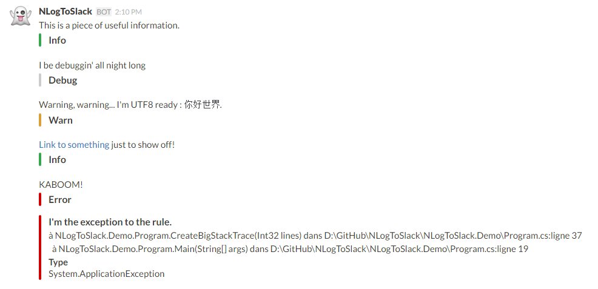
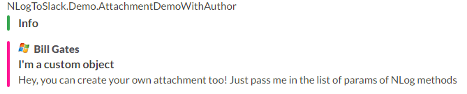
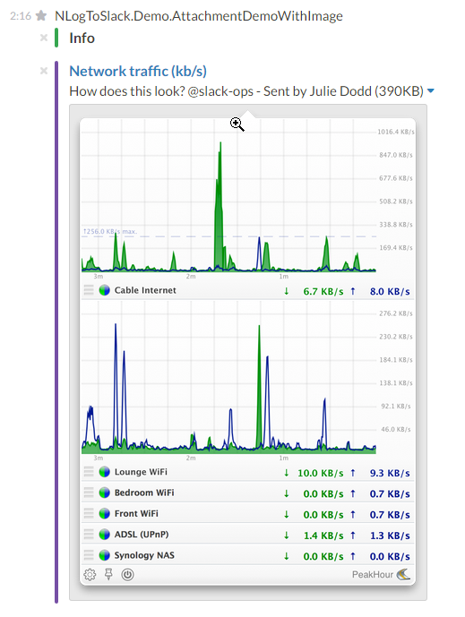

VILLAN3LL3.NLog.Slack  
============  
An NLog target for Slack - your logs in one place and instantly searchable, everywhere.  
Forked from [NTRPRS.NLog.Slack](https://github.com/nmbro/NTRPRS.NLog.Slack)

[](https://github.com/VILLAN3LL3/VILLAN3LL3.NLog.Slack/actions/workflows/dotnet-desktop.yml)

[](https://www.nuget.org/packages/VILLAN3LL3.NLog.Slack/)

Use default Features


Or create your own attachment




Installation
============
Via [NuGet](https://www.nuget.org/packages/VILLAN3LL3.NLog.Slack/): ```Install-Package VILLAN3LL3.NLog.Slack```

... or just build it yourself!

Usage
=====
1. Create a [new Incoming Webhook integration](https://slack.com/apps/A0F7XDUAZ-incoming-webhooks).
2. Configure NLog to use `VILLAN3LL3.NLog.Slack`:

### NLog.config

```xml
<?xml version="1.0" encoding="utf-8" ?>
<nlog xmlns="http://www.nlog-project.org/schemas/NLog.xsd"
      xmlns:xsi="http://www.w3.org/2001/XMLSchema-instance">

  <extensions>
    <add assembly="VILLAN3LL3.NLog.Slack" />
  </extensions>

  <targets async="true">
    <target xsi:type="Slack"
            name="slackTarget"
            layout="${message}"
            webHookUrl="https://hooks.slack.com/services/%your%/%tokens%/%here%"
            channel="#log"
            excludeLevel="false"
            embed="true"
            username="VILLAN3LL3.NLog.Slack"
            icon=":ghost:" />
  </targets>

  <rules>
    <logger name="*" minlevel="Debug" writeTo="slackTarget" />
  </rules>
</nlog>
```

Note: it's recommended to set ```async="true"``` on `targets` so if the HTTP call to Slack fails or times out it doesn't slow down your application.

### Programmatically 

```
var config = new LoggingConfiguration();
var slackTarget = new SlackTarget
{
      Layout = "${message}",
      WebHookUrl = "https://hooks.slack.com/services/%your%/%tokens%/%here%",
      Channel = "#log"
};

config.AddTarget("slack", slackTarget);

var slackTargetRules = new LoggingRule("*", LogLevel.Debug, slackTarget);
config.LoggingRules.Add(slackTargetRules);

LogManager.Configuration = config;
```

And you're good to go!

### Configuration Options

Key         | Description
-----------:| -----------
WebHookUrl  | Grab your Webhook URL (__with the token__) from your Incoming Webhooks integration in Slack
Channel     | The channel name (e.g #log) or user (e.g. @eth0) to send NLog messages to. Leave blank to use the integration default
Username    | Name of the user that NLog messages comes from. Leave blank to use the integration default
Icon        | Leave blank to use the integration default. Can either be a URL or Emoji
ExcludeLevel| Set to true to just send the NLog layout text (no colors, etc)
Embed       | Set to true to embed NLog layout text into attachment
